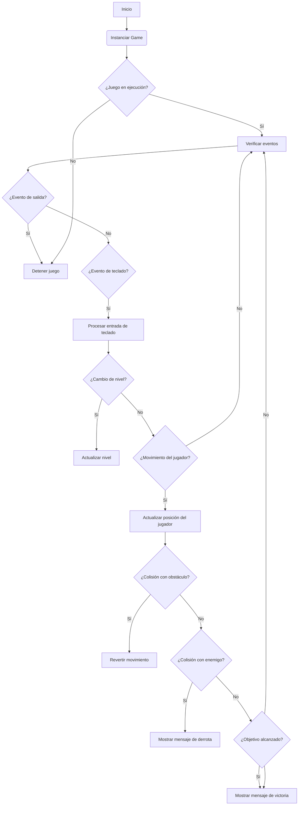
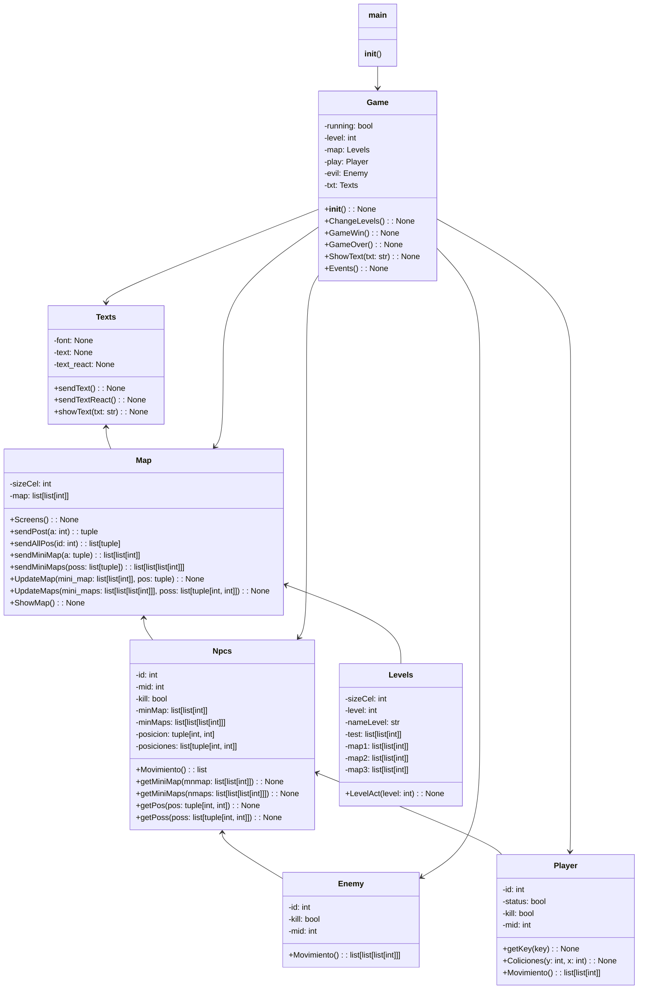

# Documentación del Código

## Introducción

Este documento proporciona una visión general del código de un juego implementado en Python utilizando la biblioteca Pygame. El juego consiste en un entorno de laberinto donde el jugador debe navegar a través de niveles, evitando enemigos y obstáculos, para alcanzar el objetivo final. Se explicarán las clases principales, sus métodos y relaciones, así como su funcionamiento en conjunto para crear la experiencia de juego.

## Estructura del Código

El código está organizado en varios archivos, cada uno con una función específica. Aquí está la estructura del proyecto:

- **Objects**: Directorio que contiene las clases principales del juego.
  - **Father**: Subdirectorio que contiene la clase base `Npcs`.
  - `Maps.py`: Definición de la clase `Map` para gestionar el mapa del juego.
  - `Npcs.py`: Definición de la clase `Npcs` para representar a los personajes no jugadores.
  - `Enemies.py`: Definición de la clase `Enemy`, una subclase de `Npcs`, para representar a los enemigos del juego.
  - `Levels.py`: Definición de la clase `Levels`, una subclase de `Map`, para gestionar los niveles del juego.
  - `Player.py`: Definición de la clase `Player`, una subclase de `Npcs`, para representar al jugador.
  - `Texts.py`: Definición de la clase `Texts` para gestionar la visualización de texto en el juego.
- `Games.py`: Implementación del bucle principal del juego y la lógica de juego.
- `main.py`: Punto de entrada del juego.

## Clases Principales

### `Map`

La clase `Map` gestiona el mapa del juego. Contiene métodos para crear la pantalla del juego, enviar posiciones, mostrar el mapa y actualizar el mapa según las acciones del jugador y los enemigos.

### `Npcs`

La clase `Npcs` representa a los personajes no jugadores en el juego. Contiene atributos y métodos comunes para todos los personajes no jugadores, como identificación, posición y movimientos.

### `Enemy`

La clase `Enemy` es una subclase de `Npcs` y representa a los enemigos del juego. Contiene lógica para el movimiento de los enemigos y su interacción con el jugador.

### `Levels`

La clase `Levels` es una subclase de `Map` y gestiona los niveles del juego. Contiene diferentes mapas para cada nivel y métodos para cambiar entre niveles.

### `Player`

La clase `Player` es una subclase de `Npcs` y representa al jugador en el juego. Contiene lógica para el movimiento del jugador y su interacción con el entorno del juego.

### `Texts`

La clase `Texts` gestiona la visualización de texto en el juego. Proporciona métodos para mostrar texto en la pantalla del juego.

### `Game`

La clase `Game` implementa el bucle principal del juego y la lógica de juego. Gestiona la ejecución del juego, incluido el cambio de niveles y la detección de fin de juego.

## Funcionamiento del Juego

El juego comienza en el archivo `main.py`, donde se instancia la clase `Game` para iniciar el juego. El bucle principal del juego se encuentra en `Games.py`, donde se gestionan los eventos del juego, se actualiza la pantalla y se verifica el estado del juego. El jugador puede moverse con las teclas direccionales y debe evitar a los enemigos y obstáculos para llegar al final del nivel. El juego termina cuando el jugador completa todos los niveles o pierde al ser atrapado por un enemigo.

## Conclusiones

Este documento proporciona una visión general del código del juego, incluyendo su estructura, las clases principales y su funcionamiento. Esperamos que esta documentación ayude a comprender y mantener el código del juego de manera efectiva.

# Clases

## Clase: Map
- Atributos:
  - sizeCel: int
  - map: list[list[int]]
  - screen: pygame.Surface

- Métodos:
  - Screens() -> None
  - sendPost(a: int) -> tuple
  - sendAllPos(id: int) -> list[tuple]
  - sendMiniMap(a: tuple) -> list[list[int]]
  - sendMiniMaps(poss: list[tuple]) -> list[list[list[int]]]
  - UpdateMap(mini_map: list[list[int]], pos: tuple) -> None
  - UpdateMaps(mini_maps: list[list[list[int]]], poss: list[tuple[int, int]]) -> None
  - ShowMap() -> None

## Clase: Npcs
- Atributos:
  - id: int
  - mid: int
  - kill: bool
  - minMap: list[list[int]]
  - minMaps: list[list[list[int]]]
  - posicion: tuple[int, int]
  - posiciones: list[tuple[int, int]]

- Métodos:
  - Movimiento() -> list
  - getMiniMap(mnmap: list[list[int]]) -> None
  - getMiniMaps(nmaps: list[list[list[int]]]) -> None
  - getPos(pos: tuple[int, int]) -> None
  - getPoss(poss: list[tuple[int, int]]) -> None

## Clase: Enemy (hereda de Npcs)
- Atributos:
  - id: int
  - kill: bool
  - mid: int

- Métodos:
  - Movimiento() -> list[list[list[int]]]

## Clase: Levels (hereda de Map)
- Atributos:
  - sizeCel: int
  - level: int
  - nameLevel: str
  - test: list[list[int]]
  - map1: list[list[int]]
  - map2: list[list[int]]
  - map3: list[list[int]]

- Métodos:
  - LevelAct(level: int) -> None

## Clase: Player (hereda de Npcs)
- Atributos:
  - id: int
  - status: bool
  - kill: bool
  - mid: int
  - key: int

- Métodos:
  - getKey(key: int) -> None
  - Coliciones(y: int, x: int) -> None
  - Movimiento() -> list[list[int]]

## Clase: Texts
- Atributos:
  - font: pygame.Font
  - text: pygame.Surface
  - text_react: pygame.Rect

- Métodos:
  - sendText() -> pygame.Surface
  - sendTextReact() -> pygame.Rect
  - showText(txt: str) -> None

## Clase: Game
- Atributos:
  - running: bool
  - level: int
  - map: Levels
  - play: Player
  - evil: Enemy
  - txt: Texts

- Métodos:
  - __init__() -> None
  - ChangeLevels() -> None
  - GameWin() -> None
  - GameOver() -> None
  - ShowText(txt: str) -> None
  - Events() -> None

## Clase: main
- Métodos:
  - main() -> None

# Diagrama de Flujo 


# Diagrama de Clases

# Diagrama Entidad Relacion
```mermaid
erDiagram
    GAME {
        id INT PK
        running BOOL
        level INT
    }
    LEVELS {
        id INT (PK)
        level_number INT
        name VARCHAR
        game_id INT FK
    }
    MAP {
        id INT PK
        sizeCel INT
        map_data TEXT
        levels_id INT FK
    }
    NPCS {
        id INT PK
        mid INT
        kill BOOL
        map_id INT FK
    }
    ENEMY {
        id INT PK
        kill BOOL
        mid INT
        npc_id INT FK
    }
    PLAYER {
        id INT PK
        status BOOL
        kill BOOL
        mid INT
        map_id INT FK
    }
    TEXTS {
        id INT PK
        font TEXT
        text TEXT
        text_react TEXT
        game_id INT FK
    }

    GAME ||--o{ LEVELS : contains
    LEVELS ||--o{ MAP : contains
    MAP ||--o{ NPCS : contains
    MAP ||--o{ ENEMY : contains
    PLAYER ||--|{ MAP : located_in
    PLAYER ||--|{ TEXTS : interacts_with
    GAME ||--|{ TEXTS : contains

```
# Other ...
