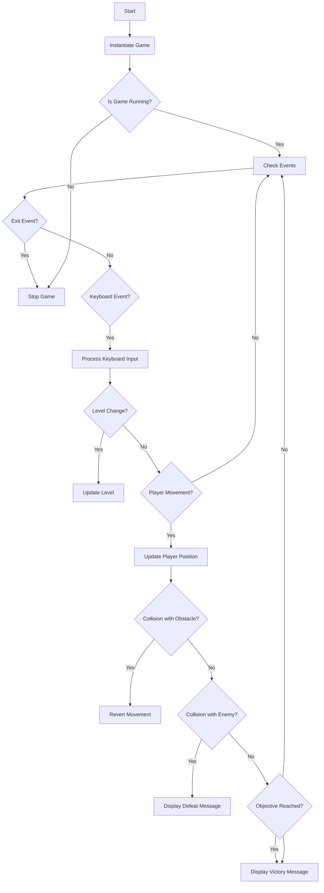
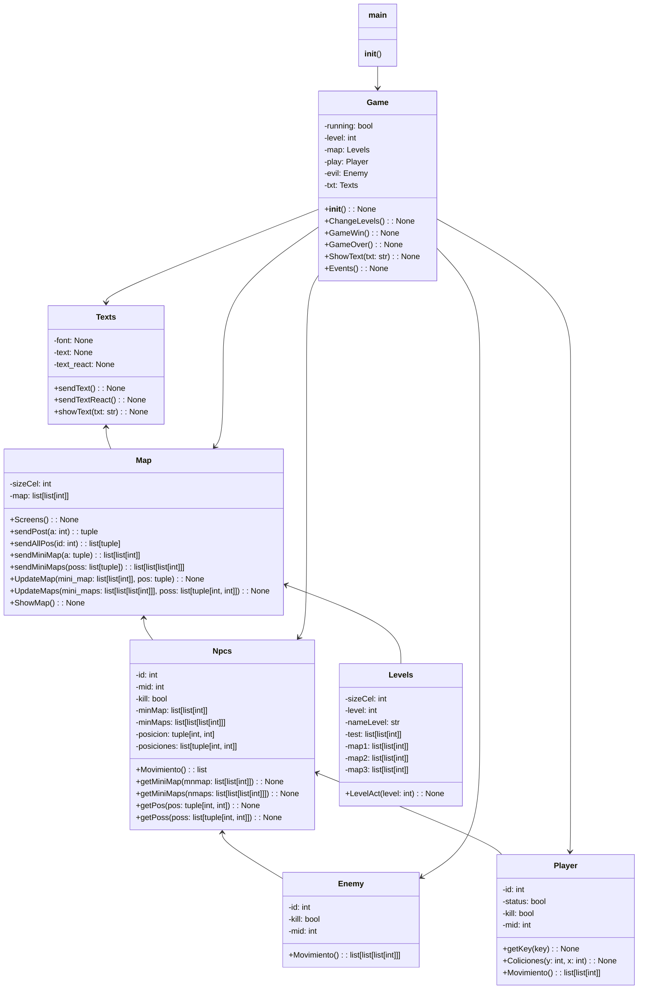
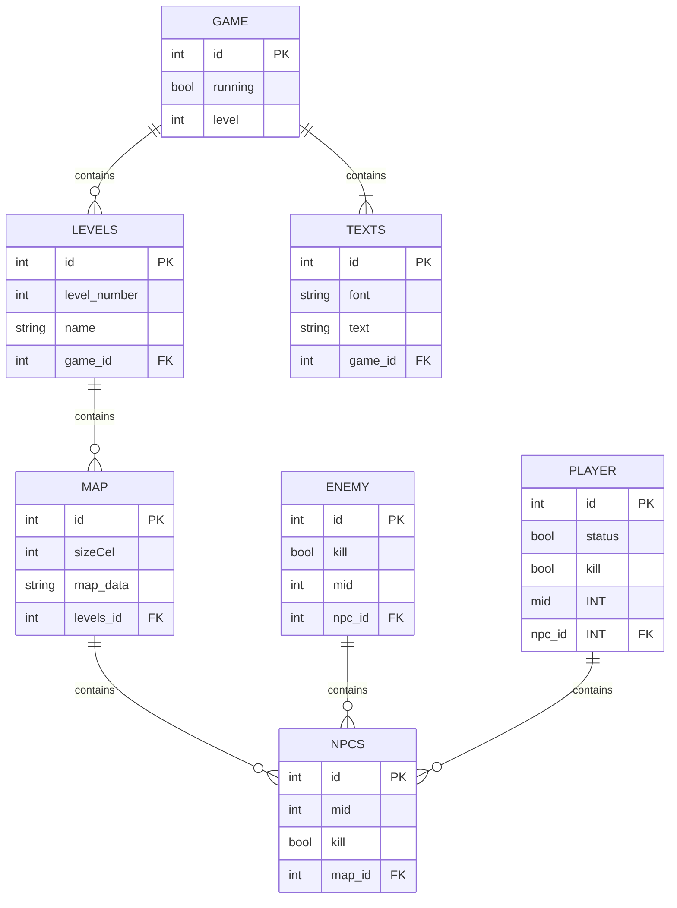

# Code Documentation

## Introduction

This document provides an overview of the code for a game implemented in Python using the Pygame library. The game consists of a maze environment where the player must navigate through levels, avoiding enemies and obstacles, to reach the final goal. The main classes, their methods, and relationships will be explained, as well as how they work together to create the gaming experience.

## Code Structure

The code is organized into several files, each with a specific function. Here's the project structure:

- **Objects**: Directory containing the main classes of the game.
  - **Father**: Subdirectory containing the base class `Npcs`.
  - `Maps.py`: Definition of the `Map` class to manage the game map.
  - `Npcs.py`: Definition of the `Npcs` class to represent non-player characters.
  - `Enemies.py`: Definition of the `Enemy` class, a subclass of `Npcs`, to represent game enemies.
  - `Levels.py`: Definition of the `Levels` class, a subclass of `Map`, to manage game levels.
  - `Player.py`: Definition of the `Player` class, a subclass of `Npcs`, to represent the player.
  - `Texts.py`: Definition of the `Texts` class to manage text display in the game.
- `Games.py`: Implementation of the main game loop and game logic.
- `main.py`: Entry point of the game.

## Main Classes

### `Map`

The `Map` class manages the game map. It contains methods to create the game screen, send positions, display the map, and update the map based on player and enemy actions.

### `Npcs`

The `Npcs` class represents non-player characters in the game. It contains attributes and methods common to all non-player characters, such as identification, position, and movements.

### `Enemy`

The `Enemy` class is a subclass of `Npcs` and represents enemies in the game. It contains logic for enemy movement and interaction with the player.

### `Levels`

The `Levels` class is a subclass of `Map` and manages game levels. It contains different maps for each level and methods to switch between levels.

### `Player`

The `Player` class is a subclass of `Npcs` and represents the player in the game. It contains logic for player movement and interaction with the game environment.

### `Texts`

The `Texts` class manages text display in the game. It provides methods to display text on the game screen.

### `Game`

The `Game` class implements the main game loop and game logic. It manages the execution of the game, including level changes and game state detection.

## Game Operation

The game starts in the `main.py` file, where the `Game` class is instantiated to start the game. The main game loop is located in `Games.py`, where game events are handled, the screen is updated, and the game state is checked. The player can move using the arrow keys and must avoid enemies and obstacles to reach the end of the level. The game ends when the player completes all levels or loses by being caught by an enemy.

## Conclusions

This document provides an overview of the game code, including its structure, main classes, and operation. We hope this documentation helps understand and maintain the game code effectively.

# Classes

## Class: Map
- Attributes:
  - sizeCel: int
  - map: list[list[int]]
  - screen: pygame.Surface

- Methods:
  - Screens() -> None
  - sendPost(a: int) -> tuple
  - sendAllPos(id: int) -> list[tuple]
  - sendMiniMap(a: tuple) -> list[list[int]]
  - sendMiniMaps(poss: list[tuple]) -> list[list[list[int]]]
  - UpdateMap(mini_map: list[list[int]], pos: tuple) -> None
  - UpdateMaps(mini_maps: list[list[list[int]]], poss: list[tuple[int, int]]) -> None
  - ShowMap() -> None

## Class: Npcs
- Attributes:
  - id: int
  - mid: int
  - kill: bool
  - minMap: list[list[int]]
  - minMaps: list[list[list[int]]]
  - position: tuple[int, int]
  - positions: list[tuple[int, int]]

- Methods:
  - Movement() -> list
  - getMiniMap(mnmap: list[list[int]]) -> None
  - getMiniMaps(nmaps: list[list[list[int]]]) -> None
  - getPos(pos: tuple[int, int]) -> None
  - getPoss(poss: list[tuple[int, int]]) -> None

## Class: Enemy (inherits from Npcs)
- Attributes:
  - id: int
  - kill: bool
  - mid: int

- Methods:
  - Movement() -> list[list[list[int]]]

## Class: Levels (inherits from Map)
- Attributes:
  - sizeCel: int
  - level: int
  - nameLevel: str
  - test: list[list[int]]
  - map1: list[list[int]]
  - map2: list[list[int]]
  - map3: list[list[int]]

- Methods:
  - LevelAct(level: int) -> None

## Class: Player (inherits from Npcs)
- Attributes:
  - id: int
  - status: bool
  - kill: bool
  - mid: int
  - key: int

- Methods:
  - getKey(key: int) -> None
  - Colisions(y: int, x: int) -> None
  - Movement() -> list[list[int]]

## Class: Texts
- Attributes:
  - font: pygame.Font
  - text: pygame.Surface
  - text_react: pygame.Rect

- Methods:
  - sendText() -> pygame.Surface
  - sendTextReact() -> pygame.Rect
  - showText(txt: str) -> None

## Class: Game
- Attributes:
  - running: bool
  - level: int
  - map: Levels
  - play: Player
  - evil: Enemy
  - txt: Texts

- Methods:
  - __init__() -> None
  - ChangeLevels() -> None
  - GameWin() -> None
  - GameOver() -> None
  - ShowText(txt: str) -> None
  - Events() -> None

## Class: main
- Methods:
  - main() -> None

# Flowchart 

# Class Diagram

# Entity Relationship Diagram

# Other ...
