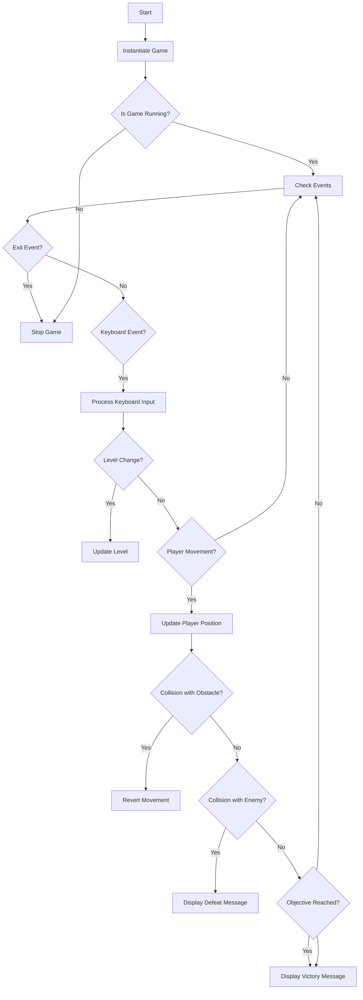
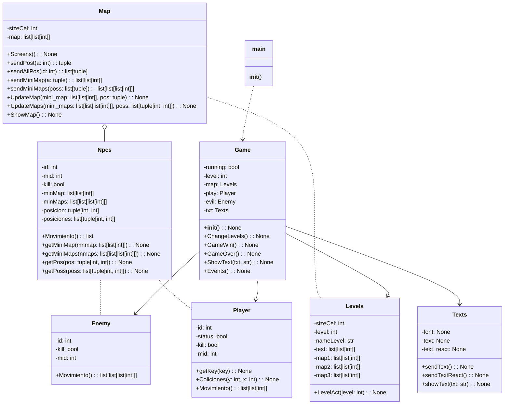
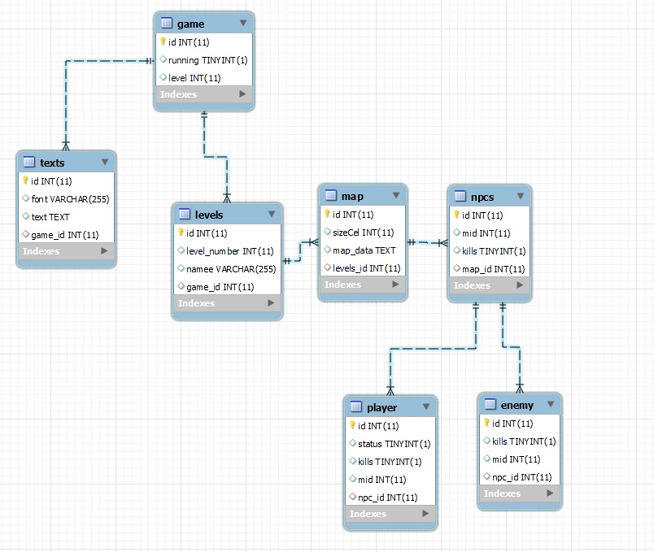
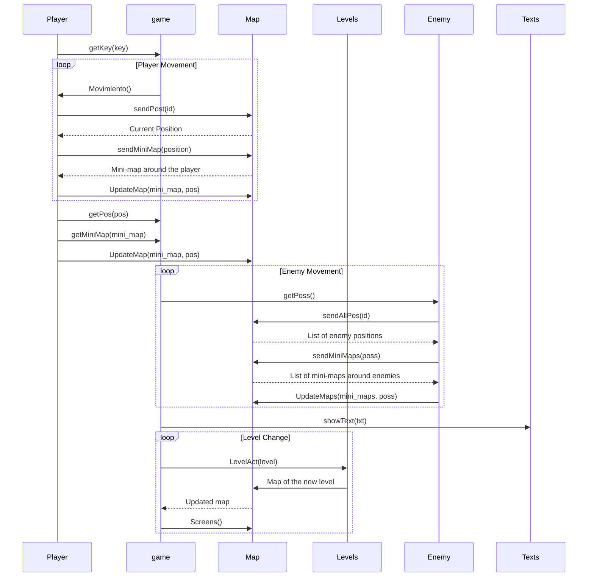

# Code Documentation

## Introduction

This document provides an overview of the code for a game implemented in Python using the Pygame library. The game consists of a maze environment where the player must navigate through levels, avoiding enemies and obstacles, to reach the final goal. The main classes, their methods, and relationships will be explained, as well as how they work together to create the gaming experience.

## Code Structure

The code is organized into several files, each with a specific function. Here's the project structure:

- **Objects**: Directory containing the main classes of the game.
  - **Father**: Subdirectory containing the base class `Npcs`.
  - `Maps.py`: Definition of the `Map` class to manage the game map.
  - `Npcs.py`: Definition of the `Npcs` class to represent non-player characters.
  - `Enemies.py`: Definition of the `Enemy` class, a subclass of `Npcs`, to represent game enemies.
  - `Levels.py`: Definition of the `Levels` class, a subclass of `Map`, to manage game levels.
  - `Player.py`: Definition of the `Player` class, a subclass of `Npcs`, to represent the player.
  - `Texts.py`: Definition of the `Texts` class to manage text display in the game.
- `Games.py`: Implementation of the main game loop and game logic.
- `main.py`: Entry point of the game.

## Main Classes

### `Map`

The `Map` class manages the game map. It contains methods to create the game screen, send positions, display the map, and update the map based on player and enemy actions.

### `Npcs`

The `Npcs` class represents non-player characters in the game. It contains attributes and methods common to all non-player characters, such as identification, position, and movements.

### `Enemy`

The `Enemy` class is a subclass of `Npcs` and represents enemies in the game. It contains logic for enemy movement and interaction with the player.

### `Levels`

The `Levels` class is a subclass of `Map` and manages game levels. It contains different maps for each level and methods to switch between levels.

### `Player`

The `Player` class is a subclass of `Npcs` and represents the player in the game. It contains logic for player movement and interaction with the game environment.

### `Texts`

The `Texts` class manages text display in the game. It provides methods to display text on the game screen.

### `Game`

The `Game` class implements the main game loop and game logic. It manages the execution of the game, including level changes and game state detection.

## Game Operation

The game starts in the `main.py` file, where the `Game` class is instantiated to start the game. The main game loop is located in `Games.py`, where game events are handled, the screen is updated, and the game state is checked. The player can move using the arrow keys and must avoid enemies and obstacles to reach the end of the level. The game ends when the player completes all levels or loses by being caught by an enemy.

## Conclusions

This document provides an overview of the game code, including its structure, main classes, and operation. We hope this documentation helps understand and maintain the game code effectively.

# Classes

## Class: Map
- Attributes:
  - sizeCel: int
  - map: list[list[int]]
  - screen: pygame.Surface

- Methods:
  - Screens() -> None
  - sendPost(a: int) -> tuple
  - sendAllPos(id: int) -> list[tuple]
  - sendMiniMap(a: tuple) -> list[list[int]]
  - sendMiniMaps(poss: list[tuple]) -> list[list[list[int]]]
  - UpdateMap(mini_map: list[list[int]], pos: tuple) -> None
  - UpdateMaps(mini_maps: list[list[list[int]]], poss: list[tuple[int, int]]) -> None
  - ShowMap() -> None

## Class: Npcs
- Attributes:
  - id: int
  - mid: int
  - kill: bool
  - minMap: list[list[int]]
  - minMaps: list[list[list[int]]]
  - position: tuple[int, int]
  - positions: list[tuple[int, int]]

- Methods:
  - Movement() -> list
  - getMiniMap(mnmap: list[list[int]]) -> None
  - getMiniMaps(nmaps: list[list[list[int]]]) -> None
  - getPos(pos: tuple[int, int]) -> None
  - getPoss(poss: list[tuple[int, int]]) -> None

## Class: Enemy (inherits from Npcs)
- Attributes:
  - id: int
  - kill: bool
  - mid: int

- Methods:
  - Movement() -> list[list[list[int]]]

## Class: Levels (inherits from Map)
- Attributes:
  - sizeCel: int
  - level: int
  - nameLevel: str
  - test: list[list[int]]
  - map1: list[list[int]]
  - map2: list[list[int]]
  - map3: list[list[int]]

- Methods:
  - LevelAct(level: int) -> None

## Class: Player (inherits from Npcs)
- Attributes:
  - id: int
  - status: bool
  - kill: bool
  - mid: int
  - key: int

- Methods:
  - getKey(key: int) -> None
  - Colisions(y: int, x: int) -> None
  - Movement() -> list[list[int]]

## Class: Texts
- Attributes:
  - font: pygame.Font
  - text: pygame.Surface
  - text_react: pygame.Rect

- Methods:
  - sendText() -> pygame.Surface
  - sendTextReact() -> pygame.Rect
  - showText(txt: str) -> None

## Class: Game
- Attributes:
  - running: bool
  - level: int
  - map: Levels
  - play: Player
  - evil: Enemy
  - txt: Texts

- Methods:
  - __init__() -> None
  - ChangeLevels() -> None
  - GameWin() -> None
  - GameOver() -> None
  - ShowText(txt: str) -> None
  - Events() -> None

## Class: main
- Methods:
  - main() -> None
# Data Dictionary

Here's a more detailed data dictionary covering all variables and relationships present in it code:

### Classes:

1. **Map**:
   - `sizeCel`: An integer representing the size of each cell in the map.
   - `map`: A list of lists of integers representing the map layout.

2. **Npcs**:
   - `id`: An integer representing the NPC's identifier.
   - `mid`: An integer representing the NPC's middle identifier.
   - `kill`: A boolean indicating if the NPC has killed the player.
   - `minMap`: A list of lists of integers representing the mini-map around the NPC.
   - `minMaps`: A list of lists of lists of integers representing a list of mini-maps around the NPC.
   - `posicion`: A tuple of integers representing the NPC's position on the map.
   - `posiciones`: A list of tuples of integers representing a list of positions of the NPC on the map.

3. **Enemy** (inherits from Npcs):
   - `id`: An integer representing the enemy's identifier.
   - `kill`: A boolean indicating if the enemy has killed the player.
   - `mid`: An integer representing the enemy's middle identifier.

4. **Levels** (inherits from Map):
   - `sizeCel`: An integer representing the size of each cell in the level.
   - `level`: An integer representing the current level of the game.
   - `nameLevel`: A string representing the name of the level.
   - `test`: A list of lists of integers representing a test level design.
   - `map1`, `map2`, `map3`: Lists of lists of integers representing different level designs.

5. **Player** (inherits from Npcs):
   - `id`: An integer representing the player's identifier.
   - `status`: A boolean indicating if the player is alive or dead.
   - `kill`: A boolean indicating if the player has killed the enemy.
   - `mid`: An integer representing the player's middle identifier.
   - `key`: An integer representing the key pressed by the player.

6. **Texts**:
   - `font`: An object representing the text font.
   - `text`: An object representing the text to display on the screen.
   - `text_react`: An object representing the position of the text on the screen.

7. **game**:
   - `running`: A boolean indicating if the game is running.
   - `level`: An integer representing the current level of the game.
   - `map`: An instance of the Map class representing the game map.
   - `play`: An instance of the Player class representing the player.
   - `evil`: An instance of the Enemy class representing the enemy.
   - `txt`: An instance of the Texts class managing text displayed on the screen.

### Global Variables and Constants:

- `main.py`: The main file of the game.

### Relationships:

- `Enemy` and `Player` inherit from `Npcs`.
- `Levels` inherits from `Map`.
- `game` has instances of `Map`, `Player`, `Enemy`, and `Texts`.
- `Player` and `Enemy` interact with `Map`.
- `game` interacts with `Levels` and `Texts`.

# Flowchart 



# Class Diagram

# Entity Relationship Diagram


# Diagram of sequence

# More...
## How to Play

Welcome to the game! Here's a quick guide to get started:

### 1. Installation and Setup

Before getting started, make sure you have Python installed on your system. Then, download the game code from the corresponding repository.

### 2. Running the Game

Open a terminal in the directory where the `main.py` file is located and execute the following command:

```bash
python main.py
```

## Objective of the Game

The objective of the game is to complete all levels without being defeated by the enemies. Each level presents unique challenges that the player must overcome.

## Character Movement

The player can move around the map using the following keys:

- **W**: Move upwards.
- **A**: Move to the left.
- **S**: Move downwards.
- **D**: Move to the right.

The player should use these keys to avoid enemies and solve puzzles in each level.

## Game Completion

To complete the game, the player must progress through all levels successfully. However, if the player is caught by an enemy or finds themselves in a dead-end situation, the game ends and they will have to start from the beginning.

Good luck and have fun!
